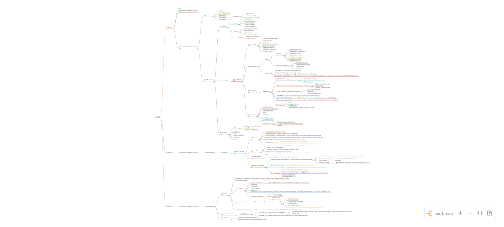
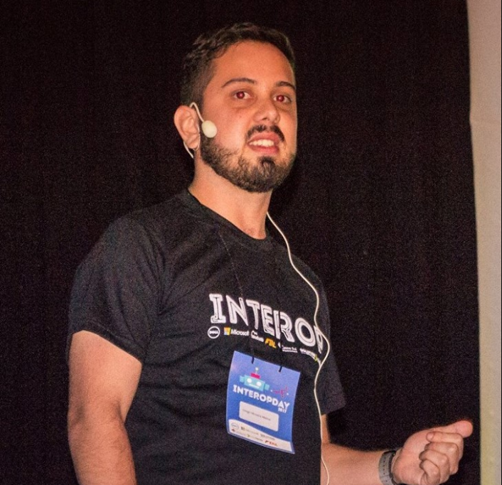

# Microsoft Reactor - AI 102 Azure AI Engineer Associate

Revisão para os conteúdos da prova de certificação AI 102 Azure AI Engineer Associate

## Mapa Mental

## Trilha de certificação
[Azure AI Fundamentals - AI900](https://learn.microsoft.com/en-us/credentials/certifications/azure-ai-fundamentals/?wt.mc_id=AZ-MVP-5003638)
- [Microsoft Reactor São Paulo #SprintAI900](https://www.youtube.com/playlist?list=PLmsFUfdnGr3yOzzC9SkekDkjonqYoZRTw)
 
[Azure AI Engineer Associate - AI102](https://learn.microsoft.com/pt-br/credentials/certifications/azure-ai-engineer/?wt.mc_id=AZ-MVP-5003638)
- [Microsoft Reactor São Paulo - Série - Revisão para prova AI-102 Azure AI Engineer Associate](https://developer.microsoft.com/pt-br/reactor/series/S-1469/)

## Microsoft Reactor São Paulo Youtube
### Sessão 01 - 06/02/2025

### Sessão 02 - 13/02/2025

[Practice Assessments](https://learn.microsoft.com/en-us/credentials/certifications/practice-assessments-for-microsoft-certifications?wt.mc_id=AZ-MVP-5003638)

## Organização

| Walter Coan |  |
| -------- | ------- |
|   | [Microsoft MVP (Internet of Things)](https://mvp.microsoft.com/pt-BR/MVP/profile/cc41c51c-7042-ea11-a812-000d3a8cc830) <ul><li>[https://github.com/waltercoan](https://github.com/waltercoan) </li><li> [https://www.linkedin.com/in/waltercoan/](https://www.linkedin.com/in/waltercoan/)</li><li> [https://www.waltercoan.com.br](https://www.waltercoan.com.br)</li> </ul>|

| Renato Groffe |  |
| -------- | ------- |
|   | [Microsoft MVP (Azure, Developer Technologies)](https://mvp.microsoft.com/pt-BR/MVP/profile/047e22a1-dd7e-e611-80f8-c4346badb51c) <ul><li> [https://github.com/renatogroffe](https://github.com/renatogroffe) </li><li> [https://www.linkedin.com/in/renatogroffe/](https://www.linkedin.com/in/renatogroffe/) </li><li> [https://renatogroffe.medium.com/](https://renatogroffe.medium.com/) </li></ul>|

| Thiago Bertuzzi |  |
| -------- | ------- |
|   | [Microsoft MVP (Developer Technologies)](https://mvp.microsoft.com/pt-BR/MVP/profile/a911f2a0-66c1-e811-816b-3863bb2e0320)<ul> <li> [https://github.com/tbertuzzi](https://github.com/tbertuzzi)</li> <li>[https://www.linkedin.com/in/thiago-bertuzzi/](https://www.linkedin.com/in/thiago-bertuzzi/)</li><li> [https://bertuzzi.com.br/](https://bertuzzi.com.br/) </li> </ul>|

| Beatriz Tavernaro |  |
| -------- | ------- |
|   | [Microsoft Student Ambassador](https://mvp.microsoft.com/pt-BR/studentambassadors/profile/5fe90cb3-bfb3-464f-99b3-87f705e7dc07) <ul> <li> [https://github.com/beatavernaro](https://github.com/beatavernaro) </li><li>[https://www.linkedin.com/in/beatriz-tavernaro/](https://www.linkedin.com/in/beatriz-tavernaro/)</li></ul>|

| Diego Moreira Matos |  |
| -------- | ------- |
|   | [Microsoft MVP (Azure)](https://mvp.microsoft.com/pt-BR/MVP/profile/b0ea8e6d-65c9-e911-a99c-000d3a137063)  <ul><li>[https://www.linkedin.com/in/digomatos/](https://www.linkedin.com/in/digomatos/)</li></ul>|